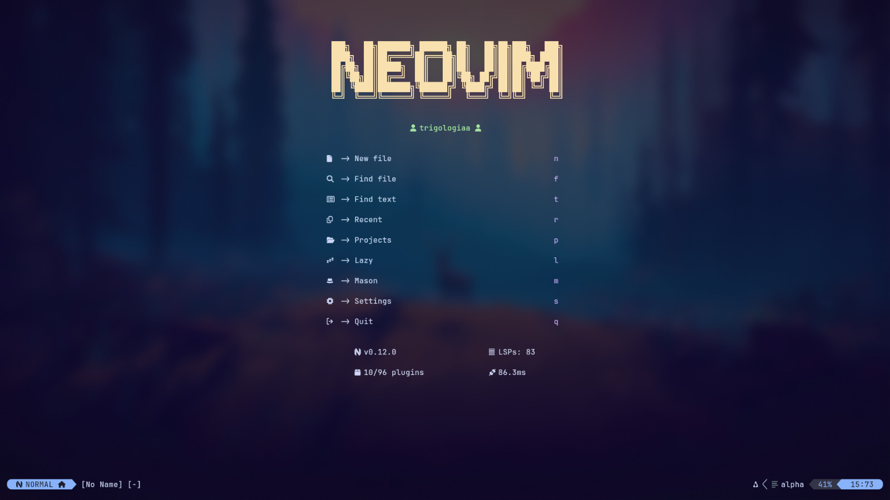

# nvim

Esta es una configuración que voy a usar, por ahora, para escribir código en el lenguaje de
programación Go... mi objetivo es expandir dicha configuración para que funcione con múltiples
lenguajes que fui aprendiendo en la universidad (y pos) en el futuro.

Uso neovim-nightly como versión, en Arch Linux con Hyprland, por lo que si alguien usa esta 
configuración, podría romperse si algo es diferente.

## Razones

Inicialmente creé esta configuración para que funcione con los lenguajes de programación que uso en
las materias de la universidad en las cuales soy ayudante de cátedra. Con un poco de suerte podré
usar esto para trabajar con ellos.

También trato de alejarme de LazyVim como configuración, ya que hay cosas con las que no temrino de
estar cómodo para trabajar.

## Dependencias

Esta configuración utiliza los siguientes programas:

- fzf

> No recuerdo todos los programas que tengo instalados, por lo que voy a ir actualizando esta lista
> (espero).

## Preview

## To-Do

- Hacer que las combinaciones de teclas relacionadas a acciones de código aparezcan en su
debido contexto
